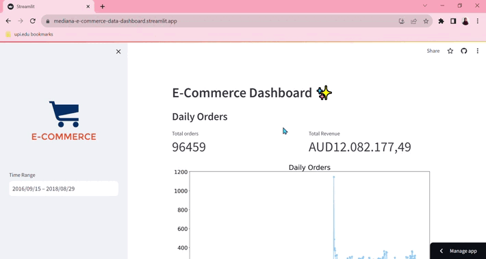

# E-Commerce Data Analysis with Python - Dicoding



[https://mediana-e-commerce-data-dashboard.streamlit.app/](https://mediana-e-commerce-data-dashboard.streamlit.app/)

## Overview

This project focuses on public data related to e-commerce through data analysis and visualization. It comes with code for exploratory data analysis (EDA), data wrangling, and an interactive data exploration dashboard called Streamlit. Analyzing data from the E-Commerce Public Dataset is the goal of this project.

## Installation

1. Clone this repository to your local machine:

```
git clone https://github.com/Iklimardiana/data-analysis-with-python
```

2. Go to the project directory

```
cd data-analysis-with-python
```

3. Install the required Python packages by running:

```
pip install -r requirements.txt or pip install numpy pandas matplotlib seaborn babel scipy strimlit
```

## Run Streamlit

streamlit run dashboard.py

## Web Deployed

[https://mediana-e-commerce-data-dashboard.streamlit.app/](https://mediana-e-commerce-data-dashboard.streamlit.app/)
